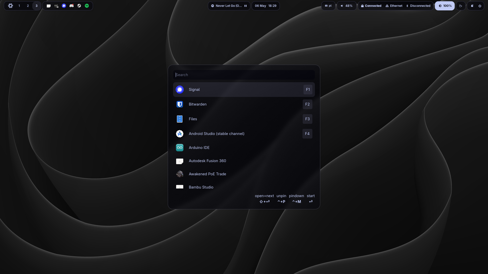

# NixOS Configuration



## Key features:
### Work machines:
- modular configuration for laptop and pc
- hyprland wm
- home-manager
- sops-nix integration
- default stable channel
- walker app launcher
- bluetooth / wifi / gpu drivers setup
- functional waybar + swaync bar configuration
- separate dev setups for multiple languages
- [Dotfiles](https://github.com/n3rsti/dotfiles)

### Server:
- nextcloud (cloud, calendar, contacts, tasks sync between all machines)
- arr stack
- paperless-ngx
- minecraft server
- immich
- tailscale
- borgbackup

## Structure

- `flake.nix`: Entry point defining all system configurations
- `hosts/`: Host-specific configurations
  - `default/`: Base configuration shared by all hosts except for server
  - `pc/`: Desktop-specific configuration
  - `laptop/`: Laptop-specific configuration
  - `server/`: Server configuration
- `modules/`: Reusable modules
  - `nixos/`: System-level modules
  - `home-manager/`: User-level modules


## Usage

### Setup a New Host

1. Generate the hardware configuration:
   ```
   sudo nixos-generate-config --show-hardware-config > hardware-configuration.nix
   ```

2. Copy the hardware-configuration.nix to the appropriate host directory:
   ```
   cp hardware-configuration.nix nix-config/hosts/[host-name]/
   ```

3. Build and switch to the configuration:
   ```
   sudo nixos-rebuild switch --flake .#[host-name]
   ```

### Rebuild Current System

```
sudo nixos-rebuild switch --flake .#
```

### Update Specific Host

```
sudo nixos-rebuild switch --flake .#[host-name]
```

## Extending Configuration

To add a new module:

1. Create a new .nix file in the appropriate modules directory
2. Import it in the relevant host configuration

To add a new host:

1. Create a new directory under `hosts/`
2. Create `configuration.nix` and `home.nix` (importing the default ones)
3. Add the new host to `flake.nix`
