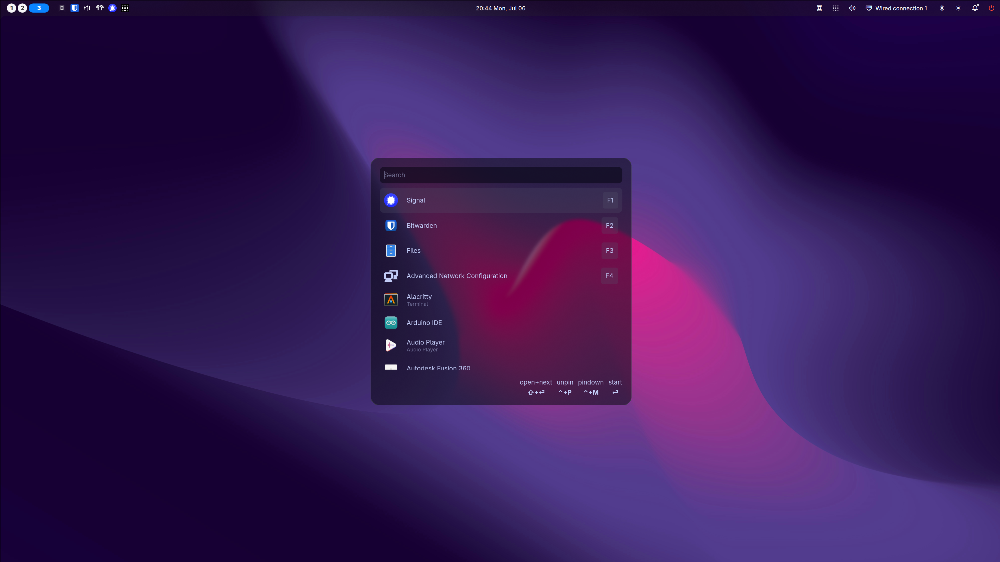
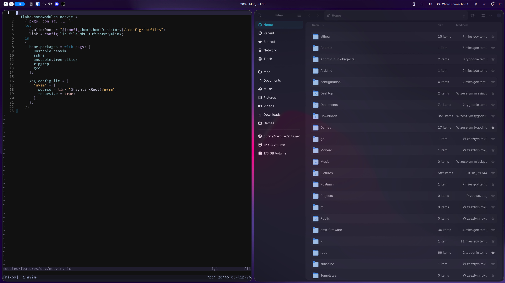

# NixOS Configuration

This repository contains my NixOS and Home Manager configuration for multiple machines, including:

- PC workstation
- Laptop
- WSL
- Server
- Virtual machines

The setup includes reusable modules that can be imported for quick host configuration. It is designed to be stable by using the stable `nixpkgs` channel for most packages.

> [!NOTE]
> Some dotfile configurations are already integrated into this repository. The rest can be found in my [dotfiles](https://github.com/n3rsti/dotfiles) repository.

## Screenshots

### Noctalia Shell Configuration





### Waybar Configuration


## Details

### General Overview

This repository manages the configuration for multiple NixOS-based systems using a modular structure. It provides ready-to-import modules and reusable profiles to simplify setup across different machines.

### Host Configurations

All personal devices use **Tailscale** for secure connectivity.

#### PC

Main workstation configured for:

- Development
- Local and remote gaming
- Remote builds for other machines

#### Laptop

Shares most of its configuration with the **PC**. It is configured for:

- Updates built remotely by the PC
- Remote desktop sharing

#### Server

Configured as a 24/7 base for device integration and self-hosted services, including:

- Remote storage with **Nextcloud**
- Movie and series streaming with the **Arr stack** and **Jellyfin**
- Minecraft server hosting with [nix-minecraft](https://github.com/Infinidoge/nix-minecraft)
- Document organization with **Paperless**
- Image storage with **Immich**
- Backups with **borgbackup**

## Repository Structure

- `flake.nix`: Entry point defining all system configurations
- `modules/`: Reusable modules
  - `features/`: Ready-to-import modules, each implementing one specific part of the system
  - `flake/`: Additional flake configuration
  - `homes/`: Home Manager and dotfiles integration
  - `hosts/`: Main host configurations
  - `profiles/`: Reusable bundles of modules, such as the `workstation` profile for the **PC** and **laptop**
  - `users/`: User definitions

## Methodology

To keep the configuration modular and maintainable across multiple hosts, this repository follows the [dendritic pattern](https://github.com/mightyiam/dendritic).

This means that each module should be a [flake-parts](https://flake.parts/) module that implements a single feature.

## Usage

### Setting Up a New Host

1. Clone the repository.

   > [!TIP]
   > Use `nix-shell -p git` if `git` is not available.

2. Create a new host under `modules/hosts/`.

3. Generate the hardware configuration:

   ```sh
   make generate-hardware-config
   ```

4. Import the selected modules, profiles, and `hardware-configuration.nix`.

5. Rebuild the system:

   ```sh
   make switch HOST=host
   ```

   Example:

   ```sh
   make switch HOST=pc
   ```
